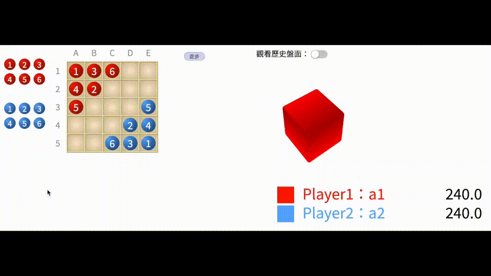

# Agent of EinStein Wiirfelt Nicht!
This is the code of the chess game agent called EinStein Wiirfelt Nicht.



## What is EinStein Wiirfelt Nicht?
- A board game that each players have 6 chesses. The game will end in the following situations.

  * Any of the chess move to the opponent's corner.
  * Either player has no chess left.

- The chesses are required to move under the following rules.
  
  * The dice will be rolled in each player's turn. 
  * If the chess number exists corresponding to the number on the chess, only this chess can be moved. 
  * Otherwise, players are able to choose either the nearest smaller or the larger number of the dice number.
  * The chess can choose one of the three directions to move.

## Game server
This is the final project of the NTU TCG competition, the server is held by Prof. Tsan-sheng Hsu. Please refer to the following [link](https://www.csie.ntu.edu.tw/~tcg/2022/finrep.php) to connect to the server.

## How to compile?

```
make
```
